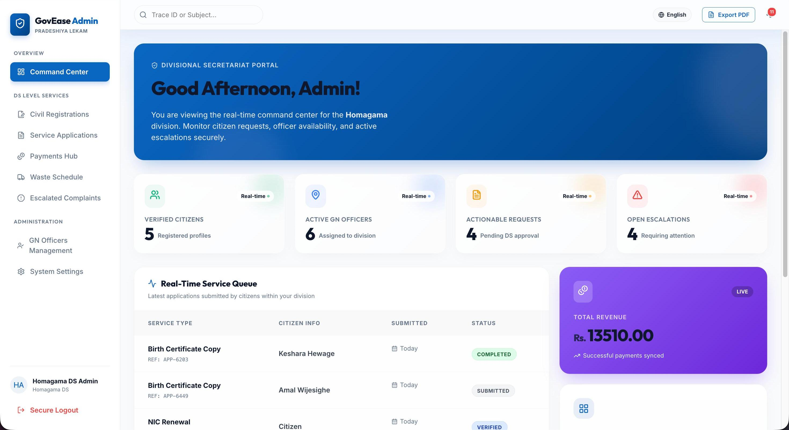
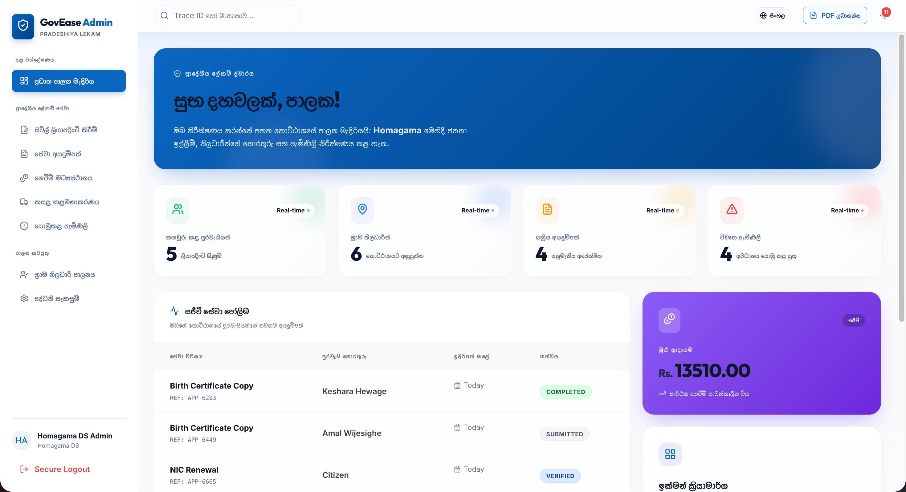
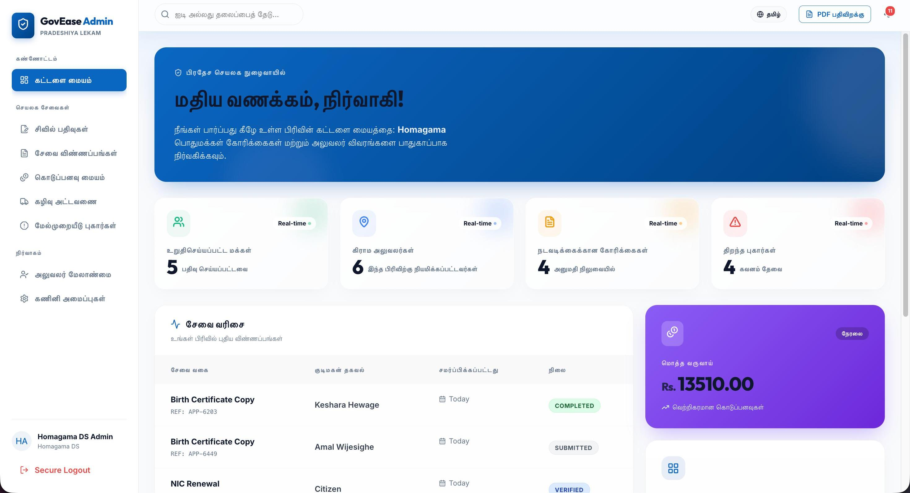

# 🏛️ GovEase - Digital Local Government Platform

 
 


**GovEase** is a unified, cross-platform e-governance ecosystem designed to modernize civic operations in Sri Lanka. It bridges the gap between the public and government officials by digitizing public service requests, document verification, and complaint management.

## 📸 Screenshots

### 💻 Web Admin Dashboard (Multi-lingual)
<div align="center">
  
  
  
</div>

### 📱 Mobile App (Citizen Dashboard)
<div align="center">
  
  &nbsp;&nbsp;&nbsp;&nbsp;
  
</div>

### 📝 Service Application Submission Flow
<div align="center">
  
  
  
  
  <br>
  
  
  
  
</div>

## 🌟 Key Features

* **📱 Multi-Role Mobile App (Flutter):** A single app with dynamic routing for Citizens and Grama Niladhari (GN) Officers.
* **💻 Glassmorphic Web Dashboard (React):** A high-fidelity command center for Divisional Secretariat (DS) Admins.
* **🔒 End-to-End Encryption:** Client-side AES-256 encryption ensures citizen data (NIC, Address) remains secure and obfuscated in the database.
* **📄 Digital Document Engine:** Citizens can apply for certificates, upload evidence, and track real-time status. GN Officers can approve/reject securely via the app.
* **⚠️ Hazard Escalation System:** Public complaints are monitored and automatically escalated to DS Admins if neglected by ground staff.
* **🗑️ Dynamic Waste Schedules:** DS Admins can update district schedules, syncing instantly with citizens' mobile apps.

---

## 🛠️ Technology Stack

**Mobile Frontend (Citizens & Officers)**
- Flutter / Dart
- Provider / Riverpod (State Management)
- Offline Cache (Hive)

**Web Frontend (DS Admins)**
- React.js / Vite
- Tailwind CSS
- Framer Motion

**Backend & Cloud Infrastructure**
- Google Firebase (Firestore, Auth, Storage, Cloud Functions)
- WebSockets for Real-time Document Tracking

---

## 📂 Project Structure

```text
GovEase/
├── Mobile App (Citizen-GN Officer)/  # Flutter mobile application
├── Admin Panel (Web Based)/          # React + Vite web dashboard
│   ├── frontend/                     # React application
│   └── backend/                      # Node.js secondary scripts
└── functions/                        # Firebase Cloud Functions
```

---

## 🚀 Getting Started

### 1. Mobile App Setup (Flutter)
```bash
cd "Mobile App (Citizen-GN Officer)"
flutter pub get
flutter run
```

### 2. Web Admin Panel Setup (React)
```bash
cd "Admin Panel (Web Based)/frontend"
npm install
npm run dev
```

*(Note: Ensure you have Firebase configuration files `google-services.json` and `firebase.js` in their respective directories before running).*

---

## 👥 Contributors

This project was developed by a team of 6 engineers:

- **Member 1 (KESHARA BHA):** Was primarily responsible for Core Citizen Identity & Cryptographic Security. This involved Authentication, Encryption, Registration, and Localization Services. They developed the AES encryption utilities, multi-lingual authentication flow, OTP services, and managed citizen models, while also securing the backend with Firestore security integrations and legacy user migrations.

- **Member 2 (HIRUSHIKA):** Engineered the Public Service Engine, Payments & Application Verification. They focused on Service Data Structuring, Storage Integrations, Payments, and Form UI. Key contributions included building the citizen application modules, setting up the payment checkout page, integrating Firebase blob storage, and architecting the certificate wallet and verification workflows across mobile and web interfaces.

- **Member 3 (CHAMODMA):** Directed the GN Officer RBAC Routing, Navigations & Dashboards. Their core focus was Access Control, Component Routing, Policy Utilities, and Officer Integrations. They implemented role-based access control, developed the global navigations and bottom nav, mapped the web routing SPA, and structured the GN Officer dashboard architecture along with appointment systems.

- **Member 4 (SAYURI):** Managed Interoperable Backend Utilities & System Workflows. They were responsible for System sync algorithms, Offline Capabilities, AI Integrations, and Backend Systems Frameworks. They developed the AI chatbot views, implemented offline sync queue services for resilience, handled document verification mutators, setup core `firestore_service`, and formulated the web-based `SystemSettings` interfaces.

- **Member 5 (NAVODA):** Constructed the Public Hazard & Escalation Framework. They handled Hazard Data Modelling, Citizen Complaints, Admin Web Escalation Syncing, and Push Notifications. They established the public hazard reporting modules natively, integrated Firebase push notification handlers, and built the React Web monitoring views (`EscalatedComplaints.jsx`) to sync escalated issues to DS Admins.

- **Member 6 (IMANSHA AGK):** Orchestrated the DS Admin Overlord, Civic Directories & Core Configurations. They focused on Web Dashboard Architecture, Project Environments, CSS Branding, and Waste Syncing. They mapped core CSS and thematic design systems, configured Vite/ESLint development environments, developed robust statistical dashboards (`Dashboard.jsx`), managed `CivilRegistrations`, and built the `WasteSchedule` infrastructure on both web and mobile.

---

## 📝 License
This project is licensed under the MIT License - see the [LICENSE](LICENSE) file for details.
